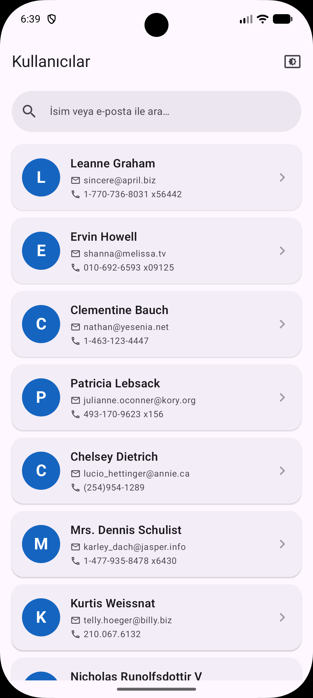
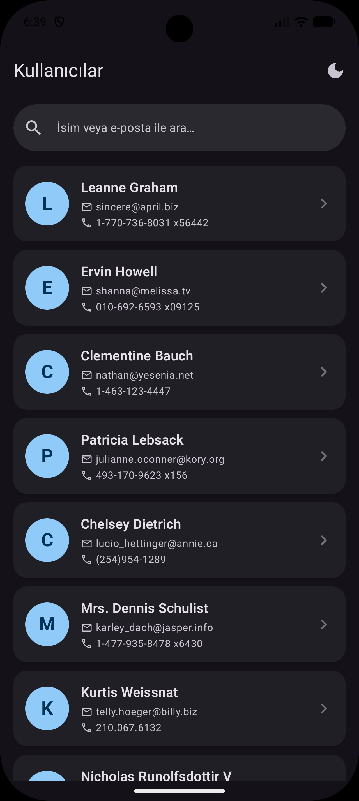
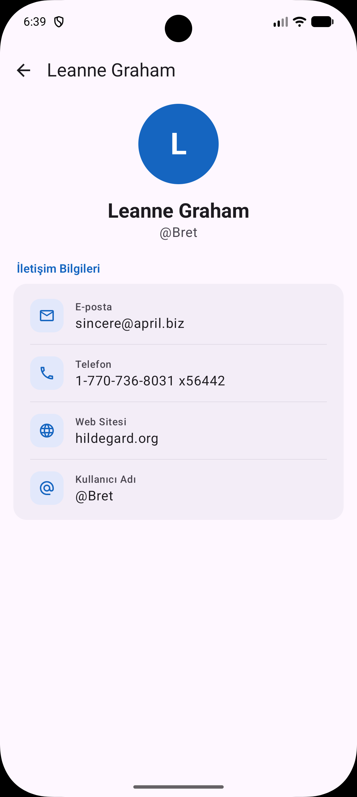
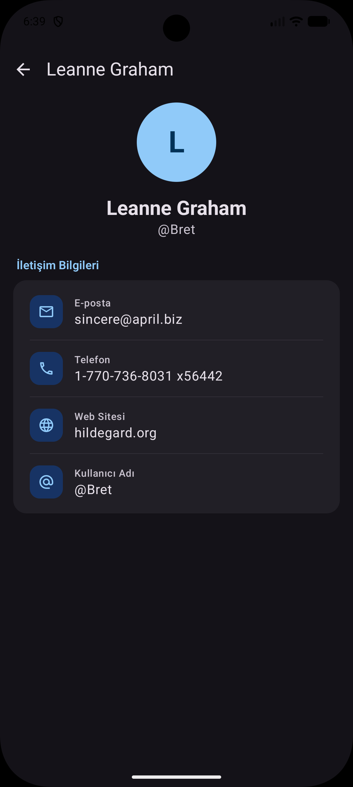
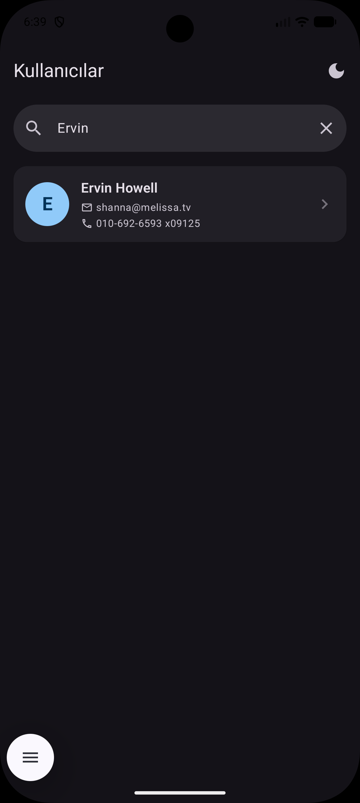
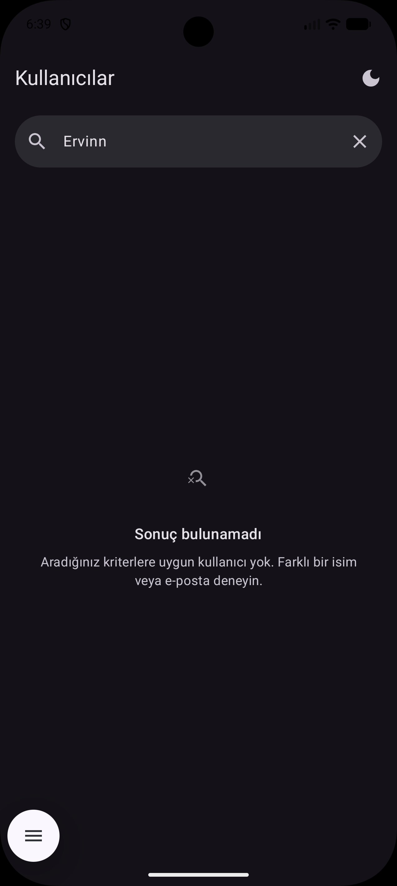
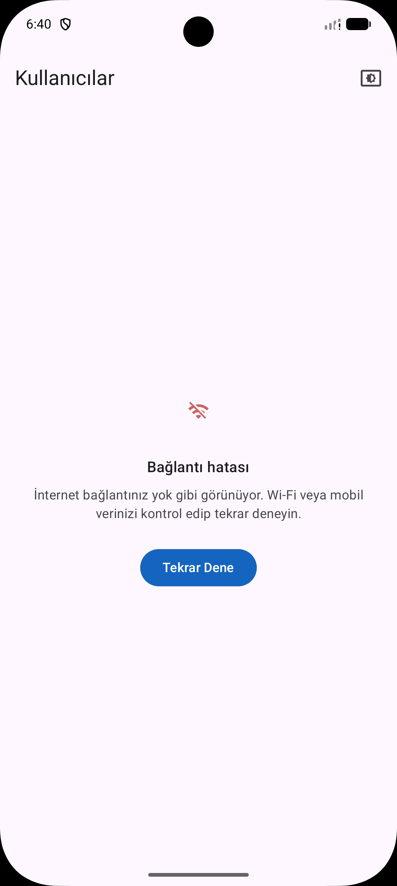
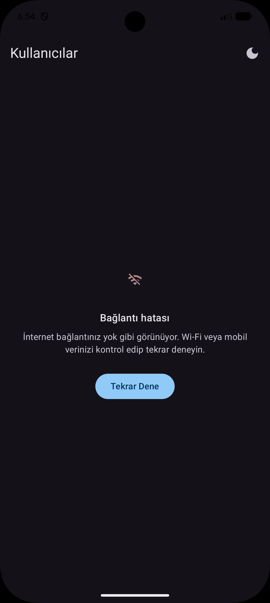

# Kullanıcı Listesi Uygulaması

JSONPlaceholder Users API üzerinden kullanıcı verisi çekerek MVVM mimarisi ile gösteren bir Android uygulamasıdır.

## Uygulama Görselleri

| Kullanıcılar Ekranı<br/> | Kullanıcılar Ekranı (Dark Theme)<br/> | Kullanıcı Detay Ekranı<br/> |
|------|------|------|
| Kullanıcı Detay Ekranı (Dark Theme)<br/> | Arama Ekranı<br/> | Arama Bulunamadı Ekranı<br/> |
| Hata Ekranı<br/> | Hata Ekranı (Dark Theme)<br/> |  |

## Kullanılan Teknolojiler

- **Kotlin** — Ana programlama dili
- **Jetpack Compose** — Modern deklaratif UI framework
- **Material 3** — Google'ın güncel tasarım sistemi
- **MVVM** — Model-View-ViewModel mimari deseni
- **Retrofit + Gson** — REST API iletişimi ve JSON dönüşümü
- **Kotlin Coroutines + StateFlow** — Asenkron işlemler ve reaktif state yönetimi
- **Hilt (Dagger)** — Dependency Injection
- **Navigation Compose** — Ekranlar arası geçiş

## Proje Yapısı

```
com.example.turkcelllistapp/
├── data/
│   ├── model/          → User.kt
│   ├── remote/         → ApiService.kt, Endpoints.kt, NetworkError.kt, NetworkResult.kt
│   └── repository/     → UserRepository.kt
├── di/                 → AppModule.kt (Hilt DI modülü)
│
├── navigation/         → UserNavHost.kt
├── ui/
│   ├── components/     → UserItem.kt
│   ├── screen/         → UserListScreen.kt, UserDetailScreen.kt
│   └── theme/          → Theme.kt, Color.kt, ThemeMode.kt, Type.kt
├── utils/              → Constants.kt, Dimens.kt (sabitler ve boyut değerleri)
├── viewmodel/          → UserViewModel.kt, UserUiState.kt
│
├── MainActivity.kt
└── UserApplication.kt
```

## Mimari Detaylar

### Endpoint Yönetimi

API base URL ve path'ler `Endpoints` objesi içinde merkezi olarak tanımlanır. Yeni endpoint eklemek için sadece bu dosya güncellenir:

```kotlin
object Endpoints {
    const val BASE_URL = "https://jsonplaceholder.typicode.com/"
    object Users {
        const val LIST = "users"
    }
}
```

### Hata Yönetimi (NetworkError Enum)

Ağ hataları `NetworkError` enum'u ile kategorize edilir. Her hata tipi için kullanıcı dostu, yönlendirici bir mesaj tanımlıdır:

| Enum | Kullanıcıya Gösterilen Mesaj |
|------|------|
| `NO_INTERNET` | İnternet bağlantınız yok gibi görünüyor. Wi-Fi veya mobil verinizi kontrol edip tekrar deneyin. |
| `TIMEOUT` | Bağlantı zaman aşımına uğradı. İnternet bağlantınız yavaş olabilir, lütfen tekrar deneyin. |
| `SERVER_ERROR` | Şu anda sunucuya ulaşılamıyor. Lütfen birkaç dakika sonra tekrar deneyin. |
| `UNKNOWN` | Bir şeyler ters gitti. Lütfen uygulamayı kapatıp tekrar açın veya daha sonra deneyin. |

Repository katmanında exception'lar `NetworkError.from(exception)` ile otomatik sınıflandırılır ve `NetworkResult<T>` wrapper ile ViewModel'e aktarılır.

### Sabit Yönetimi (Constants & Dimens)

Tüm string'ler (başlıklar, mesajlar, label'lar) `Constants` objesinde, tüm boyut değerleri (padding, radius, icon size) `Dimens` objesinde tanımlıdır. Hiçbir hardcoded değer UI katmanında doğrudan yazılmaz.

## Özellikler

### Temel
- Kullanıcı listesi (LazyColumn + Card)
- Loading / Success / Error durumları
- Dairesel avatar (ismin baş harfi)
- Hata durumunda hata tipine özel mesaj ve "Tekrar Dene" butonu

### Bonus
- **Arama çubuğu** — İsim veya e-posta ile gerçek zamanlı filtreleme. Sonuç bulunamadığında açıklayıcı boş durum ekranı gösterilir
- **Detay ekranı** — Navigation Compose ile kullanıcı detay sayfası
- **Pull-to-Refresh** — Listeyi aşağı çekerek yenileme
- **Hilt** — Dependency Injection ile temiz mimari
- **Dark Mode** — Sistem / Açık / Koyu tema geçişi (TopAppBar butonuyla)

## Kurulum

1. Projeyi klonlayın:
   ```bash
   git clone https://github.com/<kullanici-adi>/TurkcellListApp.git
   ```
2. Android Studio'da açın (Ladybug veya üzeri önerilir).
3. Gradle sync işlemini bekleyin.
4. Bir emulator veya fiziksel cihazda çalıştırın.

> **Not:** İnternet bağlantısı gereklidir (API: `https://jsonplaceholder.typicode.com/users`).

## Minimum Gereksinimler

- Android Studio Ladybug+
- Min SDK: 24 (Android 7.0)
- Target SDK: 36
- AGP: 9.1.1
- Kotlin: 2.2.10
